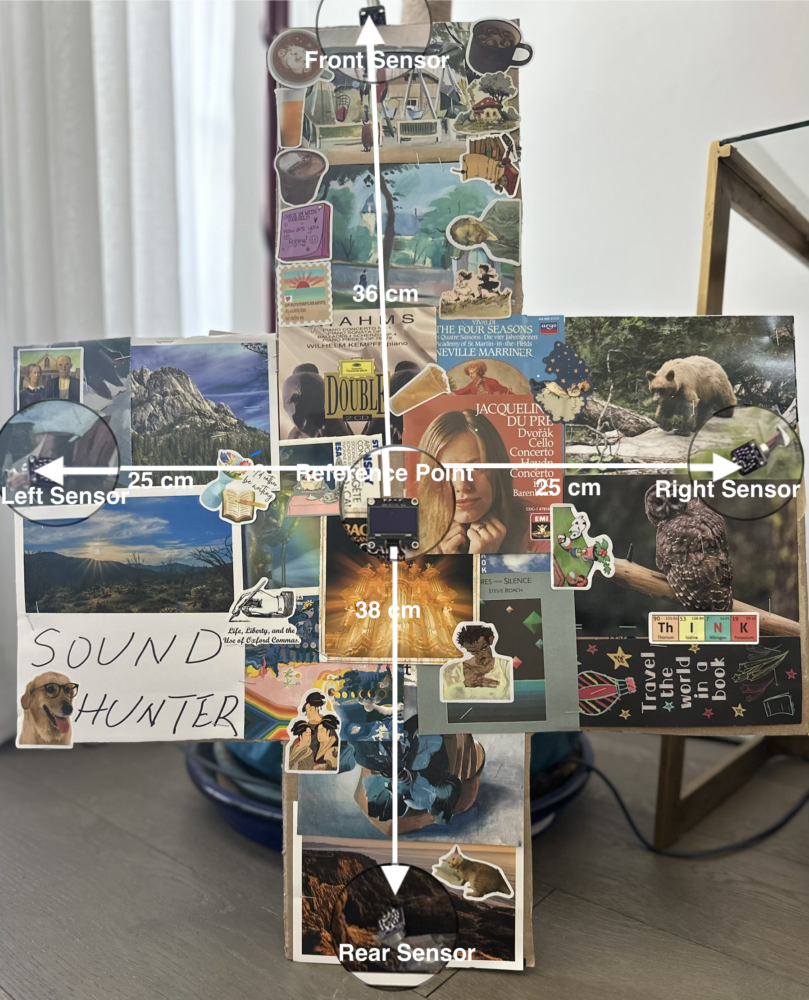
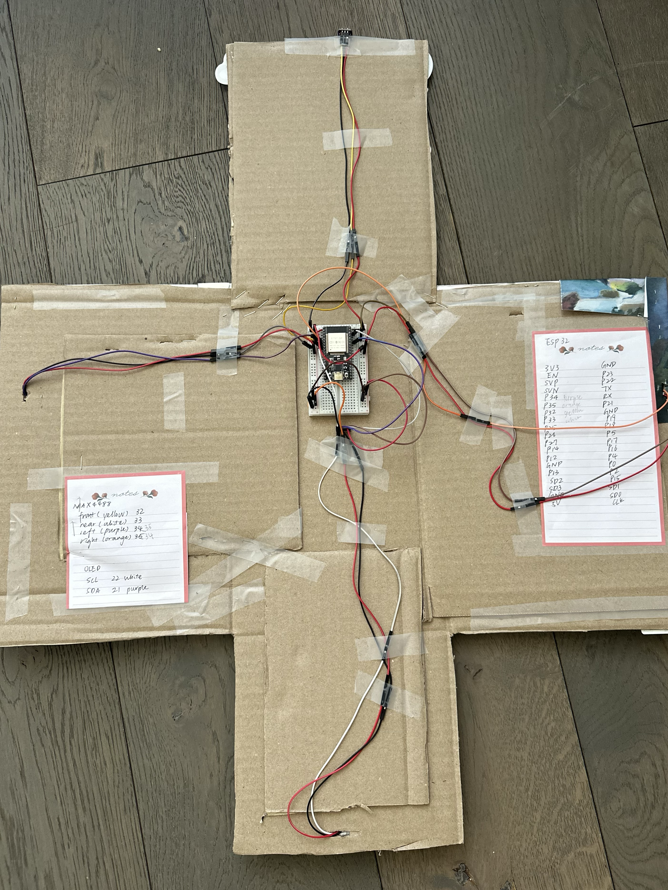
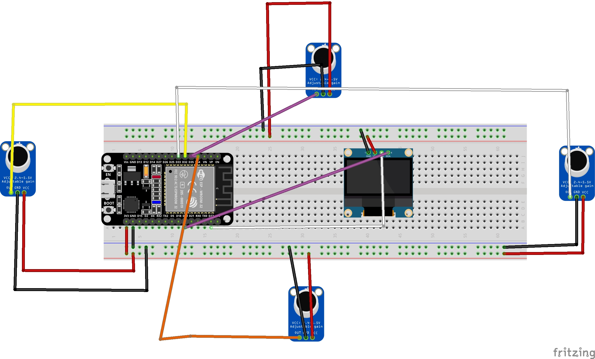
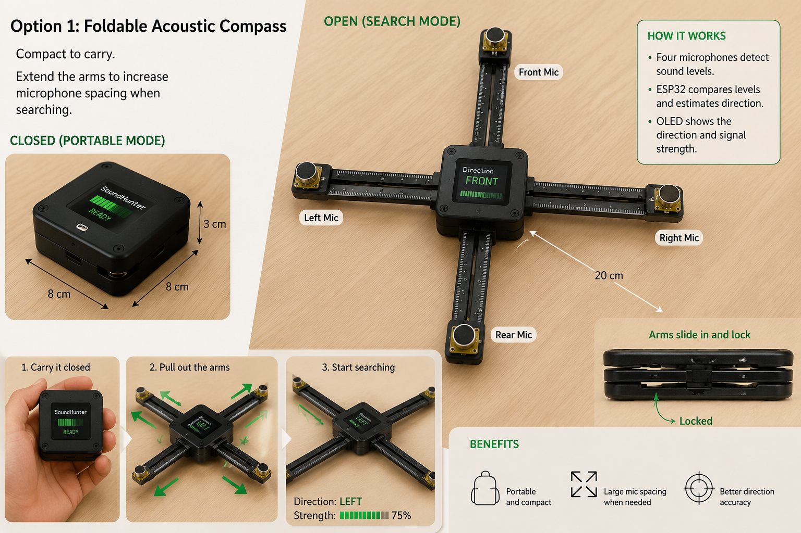
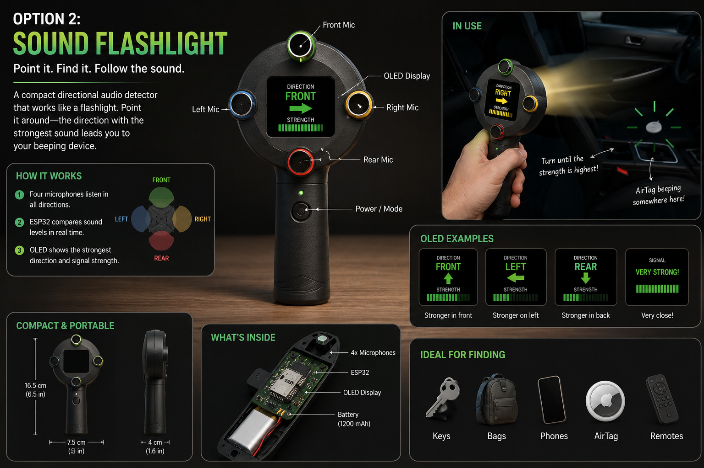
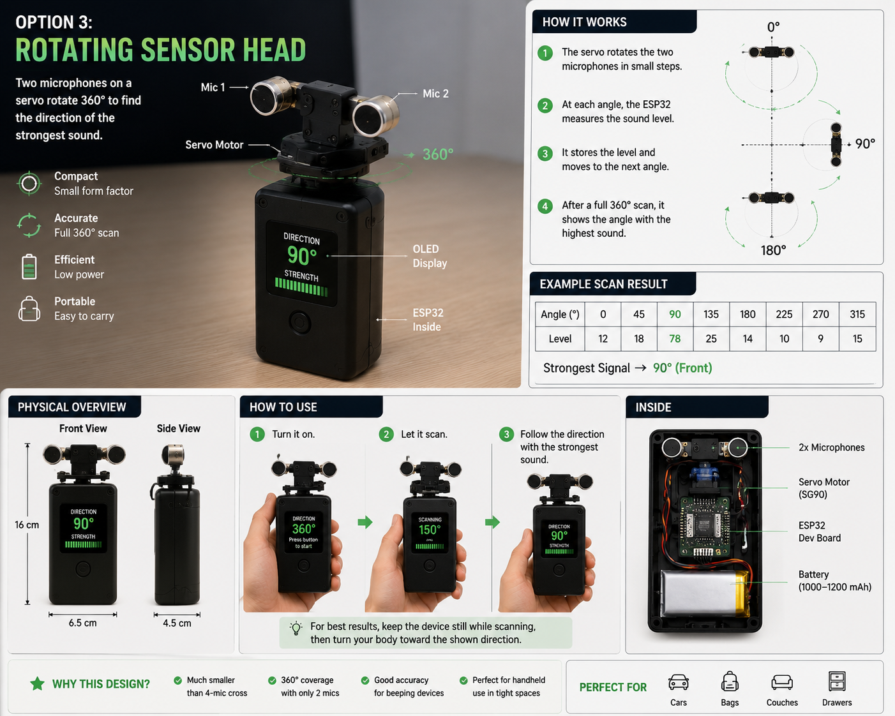
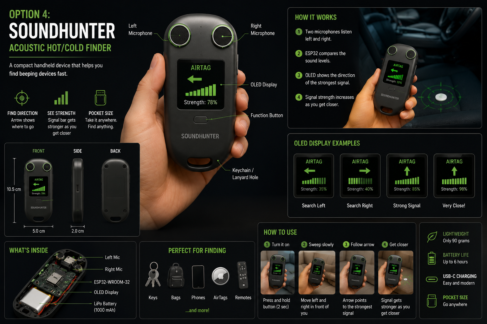
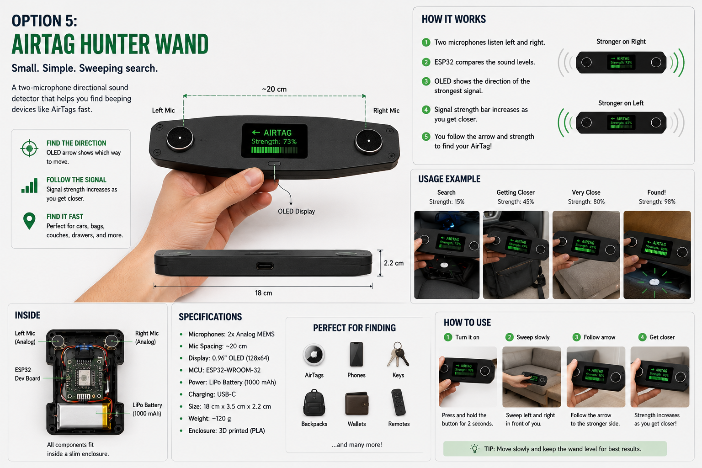

# SoundHunter

SoundHunter is an ESP32-based acoustic compass that helps locate nearby beeping devices such as AirTags, phones, alarms, or other lost electronics. It uses four analog microphone modules and a small OLED display to estimate the strongest sound direction in real time.

## Table of Contents

- [Motivation](#motivation)
- [Features](#features)
- [Hardware](#hardware)
- [Current Prototype](#current-prototype)
- [Wiring](#wiring)
- [Physical Layout](#physical-layout)
- [Software](#software)
- [Getting Started](#getting-started)
- [How It Works](#how-it-works)
- [Current Limitations](#current-limitations)
- [Future Product Concepts](#future-product-concepts)
- [Future Improvements](#future-improvements)
- [Project Status](#project-status)
- [License](#license)

## Motivation

Even with tools like AirTag and Find My, it can still be hard to find an item once you know it is nearby. An object might be inside a car, under a seat, inside a bag, or hidden in a compartment. Find My can tell you the item is close, but it does not always show the exact direction to search.

SoundHunter explores whether a low-cost microphone array can act like a simple acoustic compass. By comparing sound levels from microphones facing front, rear, left, and right, the device provides directional feedback on a small OLED display.

## Features

- ESP32-based embedded prototype
- Four-microphone acoustic sensing
- SSD1306 OLED direction display
- Front, rear, left, right, and diagonal direction estimation
- Simple sound-level comparison using ADC input
- Thresholding to ignore quiet ambient noise
- Serial monitor output for debugging and tuning
- Low-cost breadboard-friendly design

## Hardware

| Component | Purpose |
| --- | --- |
| ESP32-WROOM-32 DevKit | Main microcontroller |
| 4 x analog microphone modules | Sound sensing |
| SSD1306 128x64 I2C OLED | Direction display |
| Breadboard | Prototyping |
| Jumper wires | Connections |
| USB cable or power bank | Power supply |

## Current Prototype

The current SoundHunter prototype is a breadboard-based build centered around an ESP32, four analog microphones, and a small OLED display. The photos below show the assembled front and rear views of the device, along with the microphone module used for acoustic sensing.

This enclosure also became a small personal art project. As part of my hobby of making collages, I decorated the cardboard body with postcards, travel images, and classical music album covers that I had collected on my cupboard. I really enjoyed that process because it made the prototype feel less like a temporary electronics build and more like an object with its own character.

### Prototype Front

The front photo includes labeled dimensions showing the approximate distances between the center reference point and each sensor. The prototype is usually placed horizontally during use. It is shown vertically in this photo only to make the sensor layout and spacing easier to see.



### Prototype Back



### Microphone Module


## Wiring

### OLED

| OLED Pin | ESP32 Pin |
| --- | --- |
| GND | GND |
| VCC | 3.3V |
| SDA | GPIO21 |
| SCL | GPIO22 |

### Microphones

| Microphone | ESP32 ADC Pin |
| --- | --- |
| Front microphone OUT | GPIO32 |
| Rear microphone OUT | GPIO33 |
| Left microphone OUT | GPIO35 |
| Right microphone OUT | GPIO34 |
| All microphone VCC | 3.3V |
| All microphone GND | GND |

### Fritzing Diagram

The Fritzing layout below shows the current breadboard wiring for the ESP32, OLED, and four microphone modules.



## Physical Layout

Arrange the microphones in a cross-shaped layout:

```text
        Front Mic
            ^
Left Mic <- ESP32/OLED -> Right Mic
            v
        Rear Mic
```

For better results, place microphones at least 10-15 cm apart. If they are too close together, the direction estimate becomes less stable.

## Software

This project is built with:

- VS Code
- PlatformIO
- Arduino framework for ESP32
- Adafruit SSD1306 library
- Adafruit GFX library

Current `platformio.ini`:

```ini
[env:upesy_wroom]
platform = espressif32
board = upesy_wroom
framework = arduino
monitor_speed = 115200
lib_deps =
    adafruit/Adafruit GFX Library@^1.12.6
    adafruit/Adafruit SSD1306@^2.5.17
```

## Getting Started

1. Clone this repository.
2. Open it in VS Code with the PlatformIO extension installed.
3. Build the firmware.
4. Connect the ESP32 over USB.
5. Upload the firmware.
6. Open the serial monitor at `115200` baud to inspect microphone readings and direction output.

## How It Works

Each microphone measures the local sound level. The ESP32 reads four analog channels and estimates the dominant direction by comparing front vs. rear and left vs. right sound energy.

The core logic is:

```text
horizontal = right microphone level - left microphone level
vertical   = front microphone level - rear microphone level
```

If the front microphone hears a stronger signal than the rear microphone, the display points forward. If the left microphone hears more than the right, the display points left. Combined differences can produce diagonal directions such as front-left or rear-right.

The current firmware estimates sound level by sampling each microphone repeatedly, removing its average DC bias, and measuring the average absolute deviation. It also applies a threshold so the display stays in a quiet state when no strong sound is present.

## Current Limitations

This prototype uses amplitude comparison, not true time-difference-of-arrival localization. In other words, it estimates direction based on which microphone hears the strongest signal.

It works best for:

- Nearby beeping devices
- Phone ringtones
- Alarms
- Controlled indoor tests

It may be less accurate when:

- Sound reflects strongly inside a car
- Microphones have different gain levels
- Background noise is high
- The sound source is far away
- Microphones are placed too close together

## Future Product Concepts

To explore how SoundHunter could evolve beyond its current breadboard prototype, I generated a set of speculative product concepts using ChatGPT. These concept images are not final engineering designs. Instead, they serve as visual thought experiments for how the project might develop into a more polished, consumer-facing device.

The concepts examine different directions in portability, usability, sensing strategy, and industrial design. Together, they imagine SoundHunter as everything from a compact foldable search tool to a handheld directional detector or an active scanning device with servo-assisted sensing.

### 1. Foldable Acoustic Compass

A portable device with extendable microphone arms that increase spacing during search mode for improved directional sensing.



### 2. Sound Flashlight

A handheld directional detector designed to work like a flashlight, allowing the user to point and sweep toward the strongest sound.



### 3. Rotating Sensor Head

A servo-assisted design that rotates a two-microphone head through a full scan to estimate the angle of the strongest signal.



### 4. SoundHunter Acoustic Hot/Cold Finder

A compact pocket device that guides the user with directional arrows and signal-strength feedback as they move closer to the target.



### 5. AirTag Hunter Wand

A slim directional wand optimized for quick left-right sweeping to locate nearby beeping devices such as AirTags.



## Future Improvements

- Add calibration for microphone gain differences
- Add AirTag-specific beep detection
- Add true TDOA direction estimation
- Add a 3D-printed enclosure
- Add battery power
- Add LED arrow indicators
- Add Bluetooth or Wi-Fi dashboard
- Add logging for signal strength over time
- Compare analog microphones with I2S MEMS microphones

## Project Status

Prototype in progress.

Current goals:

- Verify OLED display
- Verify each microphone channel
- Improve denoising
- Build a cardboard cross-shaped enclosure
- Test with phone ringtone and AirTag beep
- Demo video on the way

## License

MIT License
